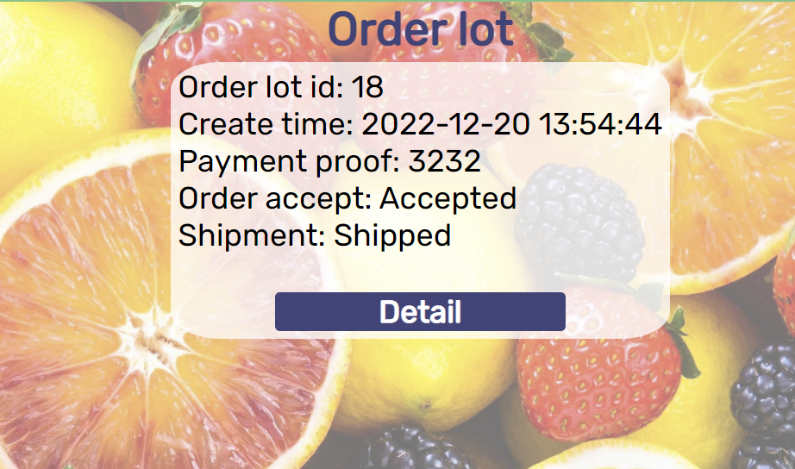

# php_dummy_furit_shop_e_commenerce_website
This is a dummy furit shop e commenerce webpages called "Furity", it has front end and backend with MySQL, I make it to learn php, html, css. This website use bootstrap grid layout.

The overall structure of this project is the classic monolithic application with high coupling. When I make it, I didn't considerate security much, the only measure should be the hashed password in the database. I only test this system by black blocktest.

It has two parts, one for customer to interface like creat account, login, buy product etc., another one for the owner (assume it is admin) to manage the slot, add item, deal with order etc.

For details, please see below, it has everythings about this porject like what each webpage/script does, what is the business flow of this webpage, how to host it on google LAMP stack VM, database structure, demo etc.

# Detail about this project

**Here has two parts, Part 1 shows operation manual (Including
how to host it) and layout of each page, Part 2 for the others
information such as database, grid layout, demo etc.**
- [Part 1](#part-1)
  - [Layout of each page](#layout-of-each-page)
  - [How host it on google LAMP VM](#how-host-it-on-google-lamp-vm)
  - [# How to use the website](#how-to-use-the-website)
- [Part 2](#part-2)
  - [# Functions of each files](#functions-of-each-files)
  - [# General page design](#general-page-design)
  - [# Database](#database)
 
**Summary of the project**

I had made a web-application for a fake fruit shop named “Fruity” to
sell fruit online. This web-application consist of two client-side
applications, one for customer, another one for admin, who are the shop
owner. This application also come with a back-end which can operate with
respective MySQL database. The application is mainly written in HTML,
CSS for frontend and PHP for backend, some JavaScript and grid system
from bootstrap are also used in assist to develop the application.

This application can be hosted at a LAMP stack VM, powered by software
show below.

<table>
<colgroup>
<col style="width: 50%" />
<col style="width: 50%" />
</colgroup>
<thead>
<tr class="header">
<th>Operating System</th>
<th><blockquote>

Debian (10.12)

</blockquote></th>
</tr>
</thead>
<tbody>
<tr class="odd">
<td>Software</td>
<td><blockquote>

Apache2 (2.4.38)

</blockquote></td>
</tr>
<tr class="even">
<td></td>
<td><blockquote>

Google-Fluentd (1.9.8)

</blockquote></td>
</tr>
<tr class="odd">
<td></td>
<td><blockquote>

MySQL-Client (5.7.39)

</blockquote></td>
</tr>
<tr class="even">
<td></td>
<td><blockquote>

MySQL-Server (5.7.39)

</blockquote></td>
</tr>
<tr class="odd">
<td></td>
<td><blockquote>

PHP (7.4.30)

</blockquote></td>
</tr>
<tr class="even">
<td></td>
<td><blockquote>

Stackdriver-Agent (6.3.0)

</blockquote></td>
</tr>
<tr class="odd">
<td></td>
<td><blockquote>

phpMyAdmin (5.0.2)

</blockquote></td>
</tr>
</tbody>
</table>

This application is developed under chrome 108.0.5359.125, which means
it should run and display normally at chrome for this and later version.
This application may not support other browsers, in fact, I find out
some page layout will mess-up when using Firefox.

This application is designed for mainly PC screen to use, it can adapt
variety of PC screen size.

# Part 1

# Layout of each page
**Customer client**

**register_login.php**

index.php

cart.php

order_lot.php

order_status.php

about_us.php

**Admin client**

admin_login.php

admin_work_space.php

admin_index_add_product.php

cart_empty.php

order_lot_empty.php

# How host it on google LAMP VM

First start the google vm LAMP Stack server. Then change var/www/html
permission to 777,

By ‘sudo chmod 777 html’, when at this location what permission you want
should desired by yours need.

Then in the source code zip, move all content except media folder and this README.md of it
into the var/www/html under SSH. Then open <http://IPhere/phpmyadmin>
and open a database called ‘fruit_store’, then import database from

sql_exported\fruity_store_s11.sql

This will import all table with few demo inside it, then change
phpMyAdmin password and set all related \$host, \$user, \$dname, \$pw
for database, on my case, it is \$host = "localhost"; \$user = "root";
\$dname = "fruity_store"; \$pw = "BnuwKJrXniU66372". The website is now
ready to use.

The import database has 1 admin account and 2 customer account already,
see Test section for details.

# How to use the website

**How to use, customer client use**

Firstly, go to http://\<ip\>/register_login.php and enter all
informations at sign up, then click button sign up to register a
account, After sign up success, an alert “Register completed, you can
login now.” Will give out, then redirect back. Then click ‘Login’ at
bottom and the element of login will be moved up, enter login and
password respectively and click Login button to sign in, after sign in
successfully, an alert “login success” give out. The user will be
redirected to index.php.

The login element(white) can
move up and down when click at login when at bottom, sign up when at
rised up state. This can switch login and sign up mod

Then, at index.php customer can add item, only 1 product type at once,
enter no .to buy number and click “To cart” on respectively item. In
here, we buy 2 bananas:

After click the “to cart”, alert: Add cart complete. Given and redirect
back, then customer can add more item. When user enter non number and
number more than the stock number(right /number), alert gives out
respectively and redirect back to this page, no action done.

After adding some product to cart, we got to Cart and side menu, open
side menu by click ☰, it will show up. Order button on this menu
redirect user to different page, ‘Home’ to index.php, , ‘Cart’ to
cart.php, ‘Order’ to order_lot.php, ‘About us’ to about_us.php, ‘Login
Sign up’ to register_login.php, ‘Logout’ to logout and redirect back to
register_login.php. Each page of customer client page have such menu.
Means user can travel thought them freely.

 Then the page will be redirect
to cart.php, it shows all product in cart the respective user have now.
All product is now on hold, and stock of product is decreased.

Click “Drop” to drop from cart, this will refresh the page with an alert
indicate drop success, the product is now add back to stock.

Click “Buy All” will create an order lot that contains all item in cart.
Item in cart will be move to this order lot. Alert “Buy all complete.
Please check order.” Given and redirect back to cart, cart is now empty.

Click Order and side menu to
access order_lot.php, that can show all order lot this account have,
click details to go to the details of the is order lot. This will
redirect to order_status.php for that order lot.

At order_status, user can see what product this order lot have. Like
below.

Enter payment proof for bank transfer number, click submit to submit it,
customer can submit multi times, each time will update the value, and
display as ‘Current:number’. \* At submission of reference number
complete, an alert gives out to remind that. At here, I enter “3232” as
payment reference. See that input field changed.

Then wait for admin to accept order, and ship order, 0 is not accepted
or not shipped, 1 is accepted and shipped. By the way, on order lot,
these value is converted to Not yet/Accepted/Shipped.

**Admin client: How to use**

Then it is job of admin. Admin Login at admin_login.php,

Then by using side menu, admin can travel between ‘Work’, to
admin_work_space.php and ‘Add products’ to admin_index_add_product.php.
Go to admin_work_space.php, we can see that new order lot with
respective data. (at lot_id:18):

See if everything is ok, if
no problems, admin can click Accept button to accept this order, ‘ship’
to ship order in this order lot, they will change Shipment:0 to 1,
Accept:0 to 1 respectively. Be remineded that respective button will be
disappeared after confirmed ship and/or accept, and each time a button
clicked the page will refresh:

 Job for admin on this order
is done.

Now head back to customer at order_status.php:

At order_lot.php:

Shipment and Order accept become 1, this trading is complete, customer
should now wait for physical fruit to arrive.

**Admin add new product**

Admin can add new product at
admin_index_add_product.php after login.enter product name, stock
number, price and including a 250x250, transparent background picture
less than 64kB to do so, hit “add” to add product:

If image is larger than 64kB, alert given and do not allow such image to
be submit.

After submission, a new product will be display at index.php, there is
no limit on how many product to show up there, however, the more product
there, the more longer the page. At index.php, product with stock of 0
will not be show up.

**How to Logout**

At both Customer and Admin client, go side menu and click “Logout” to
logout.

# Part 2

# Functions of each files

**Customer client**

The client slide is consisted of 8 webpages as shown below as well as
their function and related PHP backend script:

<table>
<colgroup>
<col style="width: 28%" />
<col style="width: 39%" />
<col style="width: 31%" />
</colgroup>
<thead>
<tr class="header">
<th>Page</th>
<th>Function</th>
<th>PHP backend script</th>
</tr>
</thead>
<tbody>
<tr class="odd">
<td>cart.php</td>
<td>
Use as a cart to show what products customer had added into
it.

Customer can drop item out from the cart here.
</td>
<td>
buy_from_cart.php

drop_cart.php

cookie_verify.php

sqlconfig.php

logout.php
</td>
</tr>
<tr class="even">
<td>cart_empty.php</td>
<td>
Tell user their cart has no product.

Not for direct access, redirect from cart.php when no product in
cart.
</td>
<td>
cookie_verify.php

sqlconfig.php

logout.php
</td>
</tr>
<tr class="odd">
<td>index.php</td>
<td>
This page is used to display all product, customer can select
product add to the cart.

First page customer should visit, will re-direct to
register_login.php if no cookie is detected (not login state).
</td>
<td>
to_cart.php

cookie_verify.php

sqlconfig.php

logout.php
</td>
</tr>
<tr class="even">
<td>order_lot.php</td>
<td>
Display all order lot a customer ordered at each different
time.

Customer can choose to read which order lot details, it save a cookie
to specify which order lot to use, and redirect to order_status.php.

If there is no order lot, redirect user to

order_lot_empty.php
</td>
<td>
to_order_status.php

cookie_verify.php

sqlconfig.php

logout.php
</td>
</tr>
<tr class="odd">
<td>order_lot_empty.php</td>
<td>
Tell user they don’t have any order lot yet.

Redirect from order_lot.php when order lot is empty. Not for direct
access.
</td>
<td>
cookie_verify.php

sqlconfig.php

logout.php
</td>
</tr>
<tr class="even">
<td>order_status.php</td>
<td>
This page shows details of an order lot. According which the
cookie pointed to from order_lot.php

User can also submit the payment proof, bank transfer reference
number in here.

Only can be accessed from choosing which order lot to read at
order_lot.php
</td>
<td>
submit_payment_proof.php

cookie_verify.php

sqlconfig.php

logout.php
</td>
</tr>
<tr class="odd">
<td>order_status_empty.php</td>
<td>Usually this page is useless, it only shows up when a order lot has
nothing inside, like nothing had been purchased. Redirect from
order_status.php when order lot is empty. Not for direct access.</td>
<td>
cookie_verify.php

sqlconfig.php

logout.php
</td>
</tr>
<tr class="even">
<td>register_login.php</td>
<td>
Use for both login and signup process

If in login, it gives cookie for user to identify them.
</td>
<td>
login.php

register.php

cookie_verify.php

sqlconfig.php

logout.php
</td>
</tr>
<tr class="odd">
<td>about_us.php</td>
<td>A simple about us page which contain a small paragraph.</td>
<td>
cookie_verify.php

sqlconfig.php

logout.php
</td>
</tr>
</tbody>
</table>

**Admin client**

Admin client is consisted of 3 pages as shown below as well as their
function and related PHP backend script:

<table>
<colgroup>
<col style="width: 35%" />
<col style="width: 27%" />
<col style="width: 36%" />
</colgroup>
<thead>
<tr class="header">
<th>Pages</th>
<th>Function</th>
<th>PHP script</th>
</tr>
</thead>
<tbody>
<tr class="odd">
<td>admin_login.php</td>
<td>
For admin to login

Gives cookie to identify a admin after login
</td>
<td>
admin_login_script.php

admin_logout.php

sqlconfig.php
</td>
</tr>
<tr class="even">
<td>admin_work_space.php</td>
<td>
For admin to check different order records.

For admin to accept order, indicate shipment, view payment proof,
address customer real name to actually sell fruit products
</td>
<td>
admin_ship.php

admin_accept.php

admin_logout.php

admin_cookie_verify.php

sqlconfig.php
</td>
</tr>
<tr class="odd">
<td>admin_index_add_product.php</td>
<td>For admin to add new product to sells, including name, stock number,
price a 250x250 image for each product add.</td>
<td>
add_product.php

admin_logout.php

admin_cookie_verify.php

sqlconfig.php
</td>
</tr>
<tr class="even">
<td>The item had not webpage</td>
<td>To create admin account directly when run it at chrome like
webpage.</td>
<td>admin_register_no_website.php</td>
</tr>
</tbody>
</table>

# General page design

All pages are in the same format. They both use grid system from
bootstrap. And all visual effect were done by CSS at mystyle.css made by
me. All bootstrap CSS file and mystyle.css were at folder css. Below
shows the grid layout by using the register_login.php as example.

Basically every page in this project mainly changes on the content at
the middle grid stated. The two other grid on same row can be bigger or
smaller according to the actually need.

Stated at the image, the bottom row is footer that will always stay at
the bottom. Oppositely the upperest row will always state at the top.
There is a icon at the left top as the company Fruity icon (icon Gen by
algorithm). On the col-sm-8, there is an indicator that indicate which
user it is currently, by its login name, if it is admin, it shows admin.
If the user is not login and that page allow that, it will show as
guest.

On page excluding about us,
login pages, you can see more than one elements inside that center grid
which hold main contents. This is done by php loop to generate it
according to the query result from MySQL. In the actual html, there is
only one element made. See left picture as an example.

You can see the red element is the origin element (red square), but
other were generated by php according to query.

These generated element will come up one after one until the end of the
query, so that like here, the more the product there is, the longer of
the page.

Furthermore, the arrangement of the generated elements is very adaptive
to the screen size, in here they are 5 in a row, but when the screen
become smaller and smaller, they can decrease to 4 in a row, even 1 in a
row. This allows flexibility on different size screen. Like below:

Those elements line 3 in row, so that they can fit well into the screen.

The tab on each page also has
a company icon, this is done by placing a 32x32 favicon.ico, company
logo at the root. It will be automatically place at the tab.

**Slide menu on every page**

On every page, there is a ☰
symbol. By click it, it will open the slide menu to navigate between
different pages. There are two set of menus, one for customer client,
one for admin client. There are several buttons inside this menu which
allows customers/admin to navigate between different page if allowed,
use by clicking the button. For customer client (left image), ‘Home’ to
the main shop page index.php, ‘Cart’ to the cart.php, ‘Order’ to the
order_lot.php, ‘About us’ to About_us.php, ‘Login in Sign up’ to
register_login.php (will redirect to index.php if logined), ‘Logout’ to
trigger logout.php script which delete all cookie and redirect to
register_login.php.

For admin client (menu on right), there are only two item, ‘Logout’ for
logout which trigger admin_logout.php which clean all admin cookies and
redirect to admin_login.php. For the other one button, on
admin_work_space.php it is ‘Add product’ which redirect to
admin_index_add_product.php. While on admin_index_add_product.php, it
redirect to admin_work_space.php. On admin_login.php, only Logout
present.

After click the respective button, it will redirect to order page, this
is controlled by adminSlideMenu.js for admin_login.php,
adminSlideMenuAdd.js for admin_index_add_product.php,
adminSlideMenuWork.js for admin_work_space.php. While for customer
client, that menu is controlled by slideMenu.js only.

All buttons on hover will change color to orange color, by CSS. Be aware
that the menu is not as long as the page.

Furthermore, this page is at z-index of highest in all of elements,
which means that it can always on top when opened.
**Special design on client
login page**

login/sign form was greatly modified from https://codepen.io/mamislimen/pen/jOwwLvy

On the client login page
register_login.php, both login and sign-up new account were done in same
page. At the origin (right picture), the login element is at the bottom,
it is in sign up mode, when click at login, the login element moves up
and cover the sign-up element, the element is now is login mode.

For other page layout, please see operation manual.

# Database

The database is consisted of
6 table, 1 table ‘admin’ specifically for admin, and other 5 ‘cart’,
‘customer’, ‘fruit_product’, ‘order_detail’, ‘order_lot’ for all use.
Below is the Entity Relationship (ER) Diagram.

Every primary key is unique and auto increment, such that each new
record can induce a new id respective to the table. Below is also the
expected flow when using the application in case of new customer and
admin. All datetime value will be using NOW() function get current time
when need to insert time.

Below shows content of each table:

<u>admin</u>

<u>cart</u>

<u>customer</u>

<u>fruit_product</u>

<u>order_detail</u>

<u>order_lot</u>

**Ideal Flow of actual use**

When customer sign up at register_login.php, it will call and pass data
to register.php, which will then input the data into the ‘customer’
table. All passcode stored at database is hashed value for security
reason. When needed, the hashed passcode will be take out and use to
compare with passcode input/in cookie. Bcrypt is used to hash passcode.

When customer do login at register_login.php, it calls login.php, Which
check if login and passcode is correct according to database by using
sqlconfig.php. Where sqlconfig.php save the information of the database
including host(\$hsot), user(\$user), database name(\$dname), and
password(\$pw). After verification, it set cookie as login name and
password. Except the ‘about us’ page, each page will check if user have
such cookie and is it valid by cookie_verify.php to verify. if no
cookie, they will be redirected to register_login.php with alert given
to say they are not logined. After pass checking, the cookie is use to
generate element respective to that customer, like item it bought.

When customer choose fruit products to add to the cart at index.php, it
calls to_cart.php which will add product to ‘cart’ with cus_id, customer
id, and deduce the stock number at ’fruit_product’. When stock number of
a product at index.php is 0, it will not be displayed at the page. At
the cart, customer can choose to drop product, this calls drop_cart.php
which remove respective product at ‘cart’ and add the stock back to
‘fruit_product’. If the customer buys all product at cart, it calls
buy_from_cart.php which move all products in ‘cart’ to ‘order_detail’
with adding a record in ‘order_lot’, respective to this lot of purchased
product.

Then customer check order_lot at order_lot.php, which shows the create
time, lot id, payment proof, order accept status, shipment status of
different order lots which belongs to same customer according to table
“order_lot”.

Then after selected the target order lot, which calls to_order_status
that save cookie for that order lot id. Then customer go to
order_status.php that display details for that order lot like what
product it have, total price etc. by using mentioned cookie and
“order_details”. Customer can also input the bank transfer number and
submit it here, this call submit_payment_proof.php which update the
pay_proof in order_lot. Up to now, customer has done all they can do,
and is waiting for admin.

At admin, it first login at admin_login.php. Similiar to customer
client. This calls admin_login_script.php and sqlconfig.php to verify
login_name and passcode. And set admin version of login name and
passcode as cookie. Such cookie is use like that in client, as all admin
page will first valid these cookie before loading in the page, if the
cookie is not valid, or do not have at all, webpage will redirect to
admin_login.php. The cookie value is also used set up the page
respective to the admin.

Then admin can check all details about the order lots and confirm the
payment from user at admin_work_space.php. This page data inside the
element is query from “fruit_product”, ”order_lot”, ”order_detail”. When
admin confirm the accept order and shipment respectively, it calls
admin_accept.php and admin_ship.php respectively to update pay_proof and
accept_state at ‘order_lot’ from 0 to 1, means accepted.

Then user at order_status.php can know their order is accepted and
product is shipment to them by observing the respective element in that
page.

When customer/admin click the ‘logout’ button at the menu, on customer
logout.php will be used to logout that clean all cookie and redirect
back to the register_login.php. While in admin, admin_logout.php will be
used that clean all cookie and redirect back to admin_login.php.

Additionally, for admin client account registration, it is not done by
any webpage, but instead at php script admin_register_no_website.php,
input the admin login name at \$login_name in the \$passcode_raw for
passcode in the script, then run the script directly at chrome. It will
add \$login_name to ‘admin’-\>’login name’, and passcode to
‘admin’-\>’passcode’ (passcode in hash).

When admin add product at admin_index_add_product.php, it had to add a
picture, the picture is limited at 64kb max, this is checked by
checkImgSize.js. The image will then upload to /img/ for display product
at inde.php. The directory of image is stored at
‘fruit_product’-\>’product_image_dir’ and will be used to find the image
when display. The add product process is done by call add_product.php to
insert data into ‘fruit_product’.

**Testing**

Black block testing is mainly used. The flow above has run twice at two
customers showed below respectively, with an admin account. 4 tests both
successes to give good wanted result.

| Customer login_name | Passcode  |
|---------------------|-----------|
| test1               | 12123434  |
| test2               | 22334455  |
|                     |           |
| Admin login_name    | Passcode  |
| admin               | admin2323 |

**Test 1 result, customer: test1 buy item kiwi:5 banana:3 orange:8
apple:5, paid and admin accept all.**

At admin_work_space.php:

At order_lot.php:

At order_status.php:

**Test 2 apple:2 kiwi:3 lemon:2 pear:7, payment proof uploaded, but not
accept or ship yet.**

At admin_work_space.php:

At order_lot.php:

At order_status.php:

You can see both test gives expected result, and database is working
within different webpage.
